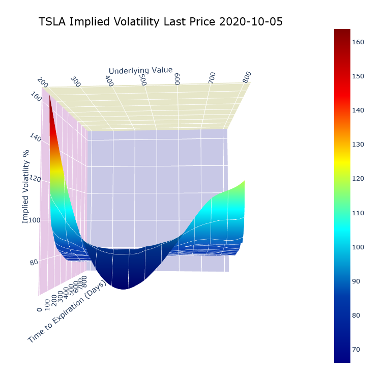
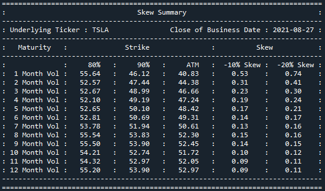

# volvisualizer
## Extract and visualize implied volatility from option chain data.

&nbsp;

A tool to extract option data from Yahoo Finance and provide visualization and smoothing to gain understanding of the supply / demand balance of options of varying strikes and tenors.

&nbsp;

### Installation
Install from PyPI:
```
$ pip install volvisualizer
```

&nbsp;

Install in a new environment using Python venv:

Create base environment of Python 3.10 (subsequent versions don't support matplotlib version 3.5.3)
```
$ py -3.10 -m venv .venv
```
Activate new environment
```
$ .venv\scripts\activate
```
Ensure pip is up to date
``` 
$ (.venv) python -m pip install --upgrade pip
```
Install matplotlib version 3.5.3 (subsequent versions have deprecated some of the 3D graph functionality)
``` 
$ (.venv) python -m pip install matplotlib==3.5.3
```
Install Spyder
```
$ (.venv) python -m pip install spyder
```
Install package
```
$ (.venv) python -m pip install volvisualizer
```

&nbsp;

To install in new environment using anaconda:
```
$ conda create --name volvis
```
Activate new environment
```
$ activate volvis
```
Install Python
```
(volvis) $ conda install python==3.10
```
Install matplotlib version 3.5.3 (subsequent versions have deprecated some of the 3D graph functionality)
``` 
$ (.venv) conda install matplotlib==3.5.3
```
Install Spyder
```
(volvis) $ conda install spyder
```
Install package
```
(volvis) $ pip install volvisualizer
```

&nbsp;

### Setup
Import volatility module and initialise a Volatility object that will extract URLs and the option data for each tenor, here specifying S&P500 as the ticker, a start date of 18th August 2021, a delay of 0.5 seconds between each API call, select only monthly expiries and a dividend yield of 1.3%.

```
from volvisualizer.volatility import Volatility
imp = Volatility(ticker='^SPX', start_date='2021-8-18', wait=0.5, monthlies=True, q=0.013)
```


&nbsp;

### Line graph of individual option expiries.
```
imp.visualize(graphtype='line')
```


&nbsp;


&nbsp;

### 3D Scatter plot of each option implied volatility by strike and expiry.
```
imp.visualize(graphtype='scatter', voltype='ask')
```


&nbsp;

### 3D Wireframe plot with scatter of each option implied volatility by strike and expiry.
```
imp.visualize(graphtype='surface', surfacetype='spline', scatter=True, smoothing=True)
```


&nbsp;

### 3D Meshgrid plot of each option implied volatility by strike and expiry.
```
imp.visualize(graphtype='surface', surfacetype='mesh', smoothing=True)
```


&nbsp;

### 3D Interactive plot of each option implied volatility by strike and expiry that can be rotated and zoomed.
```
imp.visualize(graphtype='surface',surfacetype='interactive_spline', smoothing=True, notebook=False, colorscale='Blues', scatter=True, opacity=0.8)
```


&nbsp;


&nbsp;

### 3D Interactive plot of each option implied volatility by strike and expiry using radial basis function interpolation.
```
imp.visualize(graphtype='surface', surfacetype='interactive_spline', rbffunc='cubic', colorscale='Jet', smoothing=True)
```



&nbsp;

### Extract Implied Volatility for a given maturity and strike
```
imp.vol(maturity='2021-09-30', strike=80)
```
37.61

&nbsp;

### Skew Summary Report
&nbsp;
   - Downside TSLA skew out to 12 months

```
imp.skewreport(months=12, direction='down')
```


&nbsp;

   - Upside GLD skew out to 9 months
&nbsp;

```
imp.skewreport(months=9, direction='up')
```


&nbsp;

   - Upside and Downside SPX skew out to 15 months

```
imp.skewreport(months=15, direction='full')
```


&nbsp;

Some simplifying assumptions have been made:
  - interest rates are taken from US Treasury Par Yields and these may not be the most appropriate instruments to discount with.
  - the prices are taken to be valid at the snap time; if the last trade is some time ago and / or the market is volatile then this will be less accurate.

&nbsp;

There are parameters to filter the data based on time since last trade, volume, open interest and select only the monthly options expiring on the 3rd Friday. 

Some of the smoothing techniques are very sensitive to the quality (and quantity) of input data. Overfitting becomes a problem if there aren't enough data points and the more illiquid tickers often generate results that are not to be relied upon.

Additional work is required to calibrate to an arbitrage free surface.