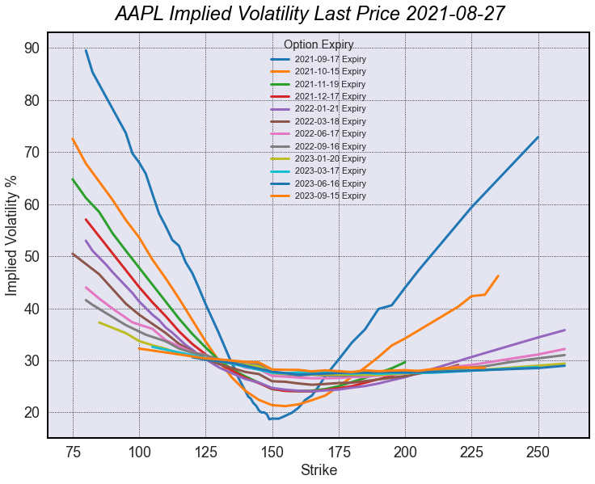

# volvisualizer
## Extract and visualize implied volatility from option chain data.

A tool to extract option data from Yahoo Finance and provide simple visualization and smoothing to get a general sense of the shape of the volatility surface.

#### Line graph of individual option expiries.

#### 3D Scatter plot of each option implied volatility by strike and expiry.

#### 3D Wireframe plot with scatter of each option implied volatility by strike and expiry.

#### 3D Meshgrid plot of each option implied volatility by strike and expiry.

#### 3D Interactive plot of each option implied volatility by strike and expiry that can be rotated and zoomed.

#### 3D Interactive plot of each option implied volatility by strike and expiry using radial basis function interpolation.

Some simplifying assumptions have been made:
  - interest rates are constant; for greater accuracy a term structure should be employed.
  - the prices are taken to be valid at the snap time; if the last trade is some time ago and / or the market is volatile then this will be less accurate.

There are parameters to filter the data based on time since last trade, volume, open interest and select only the monthly options expiring on the 3rd Friday. 
Additional work is required to calibrate to an arbitrage free surface.